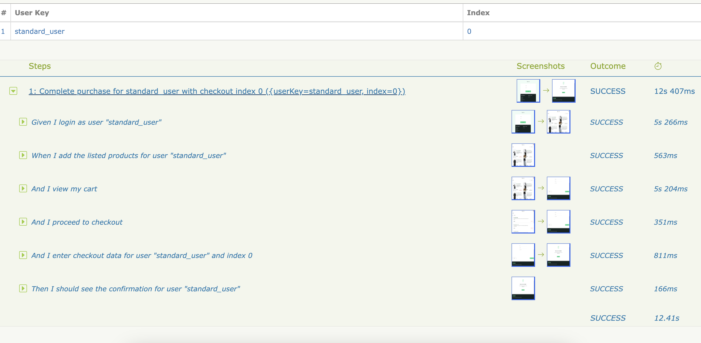

# 🧪 Automatización E2E con Serenity BDD, Cucumber y Saucedemo

Este proyecto implementa un flujo de pruebas automatizadas end-to-end sobre el sitio [Saucedemo](https://www.saucedemo.com), utilizando **Serenity BDD**, **Cucumber** y el **patrón Screenplay**. Incluye la gestión de datos externos, captura de evidencias automáticas y configuración para evitar interferencias del navegador.

---

## 🚀 Tecnologías utilizadas

- **Java (JDK 16+)**
- **Gradle 7.6.1**
- **Serenity BDD 4.2.13**
- **Cucumber 7.20.1**
- **WebDriverManager**

---

## ⚙️ Configuración del entorno

### Prerrequisitos

- Java JDK 16 o superior
- Gradle instalado 
- Navegador Chrome o Firefox

---

## 📦 Instalación y ejecución

Clonar el repositorio:

```bash
git clone https://github.com/Xaler01/e2e-saucedemo-screnplay.git
cd e2e-saucedemo-screnplay
```

### Ejecutar pruebas con Gradle

```bash
./gradlew clean test
```

### Ejecutar pruebas en Firefox

```bash
./gradlew clean test -Pdriver=firefox
```

---

## 📋 Escenario automatizado

El test principal cubre el siguiente flujo completo de compra:

1. Iniciar sesión con usuario y contraseña.
2. Agregar los productos al carrito.
3. Ingresar al carrito y proceder al checkout.
4. Cargar los datos del usuario desde `purchase-data.json`.
5. Finalizar la compra y validar el mensaje de confirmación.

---

## 📁 Estructura de carpetas

```
src
├── test
│   ├── java                      # Código de pruebas y lógica Screenplay
│   └── resources
│       ├── features             # Escenarios Gherkin
│       └── test-data            # Archivo users.json
build.gradle
serenity.conf
```

---

## 📄 Datos externos (JSON)

El archivo `purchase-data.json` permite parametrizar los datos de checkout:

```json
{
  "standard_user": {
    "username": "standard_user",
    "password": "secret_sauce",
    "products": [
      "Sauce Labs Backpack",
      "Sauce Labs Bike Light",
      "Sauce Labs Bolt T-Shirt"
    ],
    "confirmationMessage": "Thank you for your order!",
    "checkoutData": [
      {
        "firstName": "Jane",
        "lastName": "Smith",
        "zipCode": "67890"
      },
      {
        "firstName": "John",
        "lastName": "Doe",
        "zipCode": "12345"
      }
    ]
  }
}
```

---

## 📸 Reportes

Después de ejecutar las pruebas, se generan reportes visuales en:

```
target/site/serenity/index.html
```

Para abrir el reporte:

```bash
open target/site/serenity/index.html
```

---

## 🧑‍💻 Patrón Screenplay

Las pruebas siguen el patrón **Screenplay**, en el que un "actor" realiza tareas definidas como objetos. Ejemplo de tarea:

```java
theActorCalled("standard_user").attemptsTo(
    Open.url("https://www.saucedemo.com"),
    Login.withCredentials("standard_user", "secret_sauce")
);
```

Esto permite una alta legibilidad, reutilización de código y mantenimiento sencillo.

---

## ✅ Resultado esperado

Al completar el flujo de compra, se espera visualizar el mensaje:

> **"Thank you for your order!"**

---

##  Reportes Generados

Después de ejecutar las pruebas, Serenity BDD genera reportes detallados que incluyen información sobre los pasos ejecutados, capturas de pantalla de la interfaz de usuario y cualquier fallo en las afirmaciones.

Aquí se presentan algunos ejemplos de los reportes generados:


*Ejemplo de un reporte que muestra los pasos ejecutados.*



*Reporte que muestra un escenario de error en la prueba.*

---

## 📬 Contacto

Desarrollado por [@Xaler01](https://github.com/Xaler01)  
Proyecto de automatización E2E con Serenity & Cucumber
